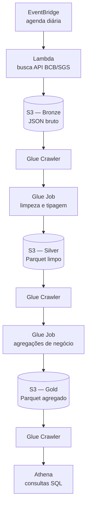

# Pipeline de Dados Econômicos — Arquitetura Medalhão na AWS

Pipeline de dados end-to-end na AWS que ingere séries temporais públicas do
Banco Central do Brasil (Selic, câmbio, IPCA), processa em camadas
**bronze → silver → gold** e disponibiliza os dados para consulta via SQL
no Amazon Athena.

Projeto construído para praticar os serviços de dados da AWS (Lambda, S3,
Glue, Athena, EventBridge) com um caso de uso real de dados públicos
financeiros.

## Arquitetura

| Camada | Conteúdo | Formato |
|---|---|---|
| **Bronze** | Dados brutos da API do BCB, sem transformação | JSON |
| **Silver** | Dados limpos, tipados e deduplicados | Parquet particionado por série |
| **Gold** | Médias mensais, min/max e variação percentual mês a mês | Parquet particionado por série |

## Stack técnica

- **AWS Lambda** (Python 3.12) — ingestão via API pública do BCB (SGS)
- **Amazon EventBridge** — agendamento diário da ingestão
- **Amazon S3** — data lake (camadas bronze/silver/gold)
- **AWS Glue** (Crawlers + Jobs Spark/PySpark) — catalogação e transformação
- **Amazon Athena** — consulta SQL sobre os dados curados
- **IAM** — roles e policies com permissões mínimas por camada

## Fonte de dados

[API SGS do Banco Central](https://dadosabertos.bcb.gov.br/) — séries
temporais públicas, sem necessidade de autenticação. Séries utilizadas:

- `11` — Taxa Selic diária
- `1` — Taxa de câmbio USD/BRL
- `433` — IPCA mensal

## Como funciona

1. Uma regra do EventBridge dispara a Lambda diariamente.
2. A Lambda busca os últimos 90 dias de cada série na API do BCB e grava o
   JSON bruto no S3, particionado por série e data de execução.
3. Um Glue Crawler cataloga a camada bronze no Glue Data Catalog.
4. Um Glue Job em PySpark lê a bronze, achata a estrutura aninhada, tipa e
   deduplica os dados, gravando em Parquet na camada silver.
5. Um segundo Glue Crawler cataloga a silver.
6. Um segundo Glue Job calcula agregados de negócio (média mensal, min,
   max, variação percentual mês a mês) e grava na camada gold.
7. Um terceiro Glue Crawler cataloga a gold, que fica disponível para
   consulta via Athena.

## Desafios encontrados

**API do BCB rejeitando requisições sem filtro de data.** Ao testar a
Lambda pela primeira vez, a busca pela série da Selic (código 11) falhava
com `HTTP 406 Not Acceptable`. Investigando, descobri que desde março de
2025 a API do BCB passou a exigir os parâmetros `dataInicial`/`dataFinal`
para séries maiores — consultas sem filtro de data (que antes retornavam o
histórico completo) passaram a ser rejeitadas. A correção foi adicionar
uma janela de datas configurável (90 dias por padrão) em toda chamada à
API.

**Permissão de leitura ausente na camada silver.** O Glue Crawler da
camada silver rodava com sucesso mas catalogava zero tabelas. A causa: a
IAM role do Glue tinha permissão de **escrita** em `silver/` (necessária
para o Glue Job gravar ali), mas não de **leitura** (`s3:GetObject`),
que o crawler precisa para inspecionar os arquivos e inferir o schema.
Ajustar a policy para incluir leitura resolveu o problema.

## Custos

Todo o projeto roda dentro do free tier da AWS, com exceção do AWS Glue,
que é cobrado por DPU-hora sem tier gratuito perpétuo. Os jobs usam o
mínimo de workers (2x G.1X) e rodam em poucos minutos, resultando em
custo de centavos por execução manual.

## Possíveis evoluções

- Dashboard em Streamlit consumindo o Athena via `boto3`
- Orquestração dos Glue Jobs via Step Functions (em vez de execução manual)
- Testes automatizados para as transformações PySpark
- Infraestrutura como código (Terraform/CloudFormation)
